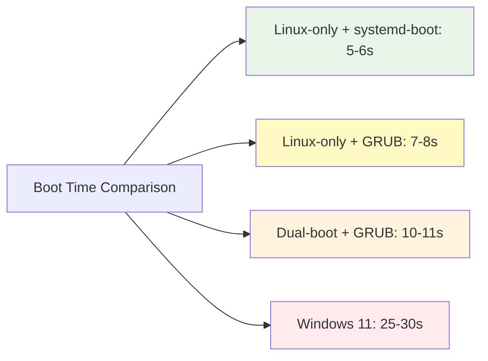
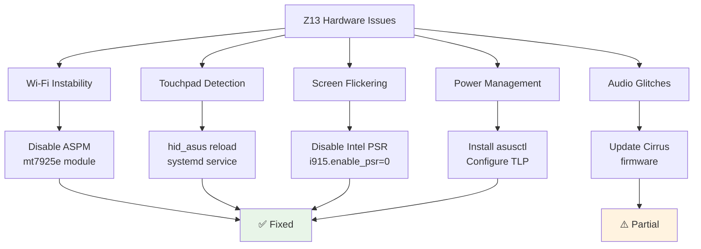
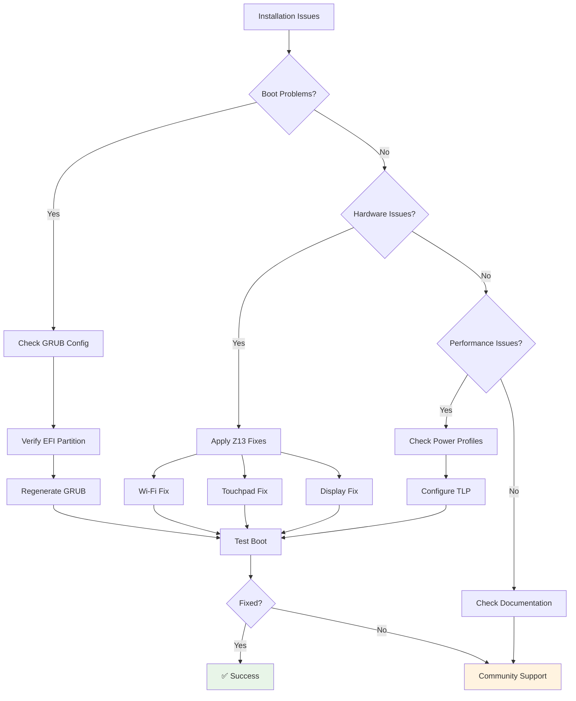
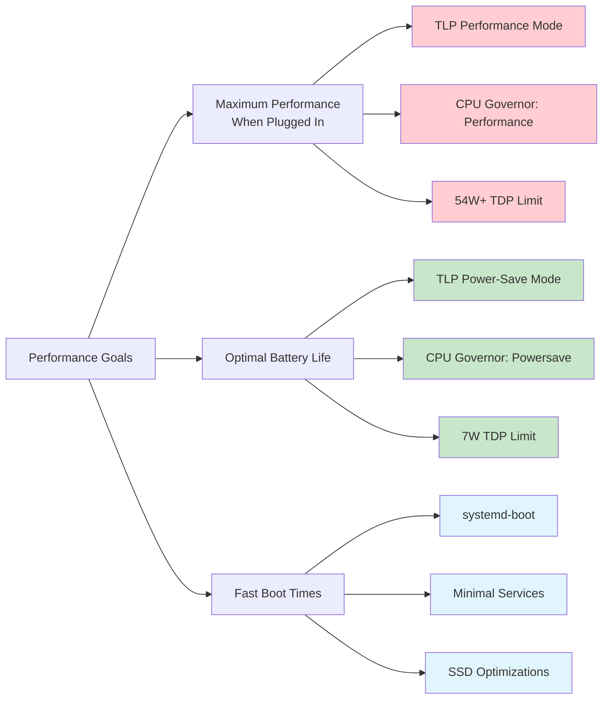

# ASUS ROG Flow Z13 Arch Linux Installation Flowchart

## Installation Process Flow

**Note:** This flowchart references files in the `Docs/` directory. All installation guides are now organized under `Docs/` for better structure.

```mermaid
graph TD
    A[📖 Read Docs/Instructions.md] --> B{Have Dedicated SSD?}
    B -->|Yes| C[🚀 Linux-Only Installation<br/>5-6s boot time]
    B -->|No| D[💾 Backup Windows System]
    
    C --> C1[Backup Windows to External]
    C1 --> C2[Wipe Entire SSD]
    C2 --> C3[Use systemd-boot]
    C3 --> F
    
    D --> E[🛡️ Create Recovery Media]
    E --> F[🔧 Shrink Windows Partition]
    F --> G[✅ Verify Windows Still Boots]
    G --> H[💿 Boot Arch Linux USB]
    
    H --> I{Choose Installation Method}
    I -->|🤖 Automated| J[Run curl command<br/>pcmr.sh]
    I -->|📋 Manual| K[Follow Docs/Instructions.md]
    
    J --> L[⚙️ Configure Options]
    K --> L
    
    L --> M[Desktop Environment?]
    M --> M1[Omarchy - Tiling WM (Default)]
    M --> M2[XFCE - User Friendly]
    M --> M3[i3 - Tiling WM]
    M --> M4[GNOME - Full DE]
    M --> M5[KDE - Feature Rich]
    M --> M6[Minimal - No GUI]
    
    M1 --> N
    M2 --> N
    M3 --> N
    M4 --> N
    M5 --> N
    M6 --> N
    
    N[🎮 Gaming Setup?]
    N -->|Yes| N1[Install Steam + Proton]
    N -->|No| O
    N1 --> O
    
    O[⚡ Power Management]
    O --> O1[Configure AMD Strix Halo TDP<br/>7W-120W Dynamic Control]
    O1 --> O2[Charger Detection<br/>Auto-adjust TDP limits]
    O2 --> P
    
    P[📸 ZFS Snapshots?]
    P -->|Yes| P1[Setup ZFS Auto-Snapshots]
    P -->|No| Q
    P1 --> Q
    
    Q[🔧 Install Arch Linux<br/>with Zen Kernel]
    Q --> R[Apply Z13 Hardware Fixes]
    R --> R1[Wi-Fi Stability Fix<br/>MediaTek MT7925e]
    R --> R2[Touchpad Detection<br/>hid_asus driver]
    R --> R3[Screen Flicker Fix<br/>Intel PSR disabled]
    R --> R4[Power Management<br/>asusctl + TLP]
    R --> R5[Zen Kernel Benefits<br/>Low latency + Gaming]
    
    R1 --> S
    R2 --> S
    R3 --> S
    R4 --> S
    R5 --> S
    
    S[🔄 Test Dual-Boot]
    S --> T{Boot Test Results}
    T -->|✅ Success| U[🎉 Complete Setup]
    T -->|❌ Issues| V[🔧 Troubleshoot]
    
    V --> V1[Check GRUB Config]
    V --> V2[Verify Partitions]
    V --> V3[Test Hardware]
    V1 --> W{Fixed?}
    V2 --> W
    V3 --> W
    
    W -->|Yes| U
    W -->|No| X[📞 Seek Help]
    
    U --> Y[🚀 Enjoy Arch Linux!]
    
    style A fill:#e1f5fe
    style B fill:#fff3e0
    style C fill:#e8f5e8
    style J fill:#f3e5f5
    style U fill:#e8f5e8
    style U1 fill:#fff3e0
    style U2 fill:#e8f5e8
    style U3 fill:#e8f5e8
    style U4 fill:#e8f5e8
    style Y fill:#e8f5e8
    style V fill:#ffebee
    style X fill:#ffebee
```

## Decision Points Explained

### 1. **Dedicated SSD Choice**
- **Yes**: Single-OS installation with optimal performance
- **No**: Dual-boot setup preserving Windows

### 2. **Installation Method**
- **Automated**: Beginner-friendly script with prompts
- **Manual**: Full control over every step

### 3. **Desktop Environment Options**
- **i3**: Minimal, keyboard-driven, excellent for productivity
- **GNOME**: Modern, touch-friendly, good tablet mode
- **KDE**: Highly customizable, Windows-like
- **Minimal**: Command-line only, maximum performance

### 4. **Gaming Setup**
- Installs Steam, Proton, GameMode, MangoHUD
- Enables multilib repository for 32-bit games
- Configures AMD GPU drivers

### 5. **Power Management**
- Configures asusctl for ASUS-specific features
- Sets up TLP for battery optimization
- Enables 7W-54W TDP control

## Boot Time Comparison



## Hardware Fix Pipeline



## Troubleshooting Flow



## Performance Optimization Path


